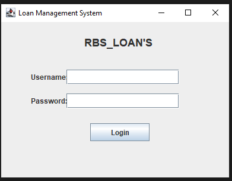
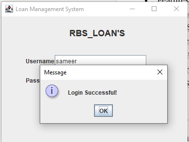
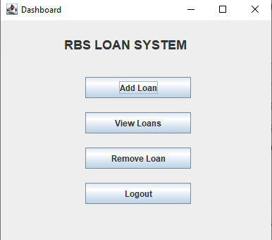
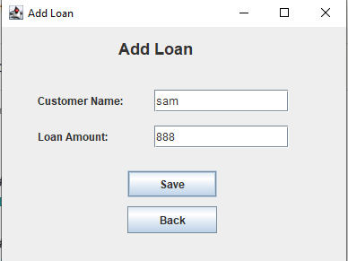
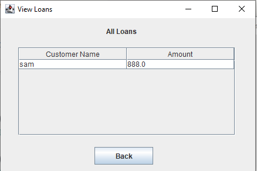
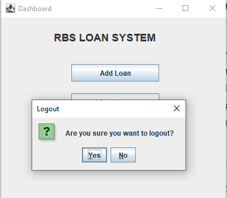

# Loan Management System

## Project Description

Loan Management System is a Java Swing desktop application developed for local shopkeepers to manage customer loans and payments digitally.

The system allows users to:

* Add customers
* Create loans
* Record payments
* Track remaining balances
* Removes Loans

This project is developed for the Software Construction and Development (SCD) course.

## Features

* Loan Management
* Payment Management
* Event Handling
* Exception Handling
* Input Validation
* Unit Testing
* Git & GitHub Integration

## Technologies Used

* Java
* Java Swing
* Eclipse IDE
* Git
* GitHub
* JUnit

## How to Run

1. Clone the repository.
2. Open the project in Eclipse.
3. Run the Main class.
4. Use the application.

## Screenshots

1. Log-In

2. Log-In Sucess

3. Dashboard

4. Add Loan

5. View Loan 

6. Remove Loan 

7. Log-out

## Author
Sameer Ali

